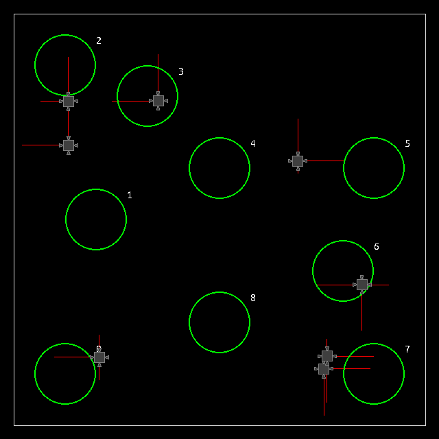
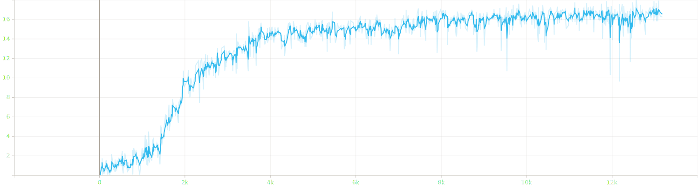

# DroneRacing

DroneRacing is a lightweight and flexible learning environment designed for experimenting with evolution-based optimization and provides numerous opportunities for customization and expansion.

The example below shows non-interacting drones navigating a track through a series of gates. The red lines represent the thrust force applied by the drone engines as they follow the course.

<p align="center">
    
</p>

The following graph shows the average reward over a period of about 13.000 generations. Agents receive a reward of +1 for reaching the next gate.

<p align="center">
    
</p>

## Features

**Physics Simulation**: Powered by *PyBox2D*, DroneRacing offers a robust rigid-body physics simulation.

**Rendering & Visualization**: Visualize the drones and their environment using *Pygame*, with clear, real-time feedback on drone behavior.

**Customizable Reward Function**: The drones' behavior is governed by a reward function that can be easily modified to suit various optimization goals.

**Flexible Race Tracks**: Race tracks can be easily added or modified, allowing you to create custom courses to challenge and test drone performance.

## Installation

To run *DroneRacing*, install the latest master directly from GitHub. For a basic install, run:

```bash
git clone https://github.com/kaifishr/DroneRacing
cd DroneRacing 
pip install -r requirements.txt
```

Then start the optimization by running:

```bash
python train.py
```

Evaluate the progress by running:

```bash
python eval.py
```

Visualization can be turned on and off by clicking on the *Pygame* window or by pressing <kbd>Space</kbd>. Turning off visualization greatly accelerates the optimization process. Ray casting can also be turned off by pressing <kbd>r</kbd>.

## Method

*DroneRacing* uses *PyBox2D* to create a physical environment the drones can interact with. Drones use raycasting to gather distance information about obstacles in their surroundings. This information is fed into the drone's neural network to predict the next set of actions. These actions are passed on to the engines, which then command the power at which they run.

## Learning

The reward function controls the learning behavior of the drone. The reward is a function of gates passed by the drone. The reward function can be modified as desired. *DroneRacing* lets you modify many hyperparameters that affect how fast and what the drones learn. Most of the hyperparameters can be found in the *config.yml* file.

## Tracks

*DroneRacing* has static and random tracks that vary in difficulty. Depending on the track, the drones learn different flight behaviors. Tracks can be easily added or modified.

## References

- [PyBox2D](https://github.com/pybox2d/pybox2d) on GitHub.
- [backends](https://github.com/pybox2d/pybox2d/tree/master/library/Box2D/examples/backends) for PyBox2D.
- PyBox2D [tutorial](https://github.com/pybox2d/cython-box2d/blob/master/docs/source/getting_started.md).
- PyBox2D C++ [documentation](https://box2d.org/documentation/).

## Citation

If you find this project useful, please use BibTeX to cite it as:

```bibtex
@article{fischer2024droneracing,
  title   = "DroneRacing",
  author  = "Fischer, Kai",
  journal = "GitHub repository",
  year    = "2024",
  month   = "August",
  url     = "https://github.com/kaifishr/DroneRacing"
}
```

## License

Apache License 2.0