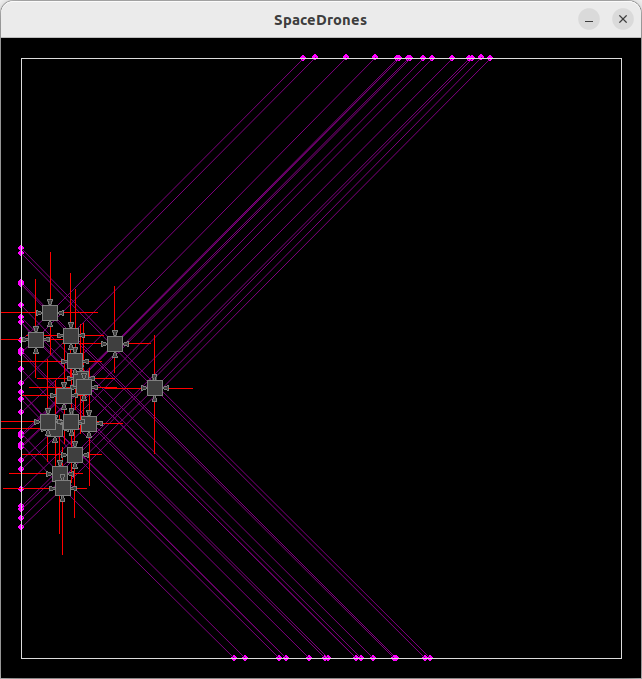
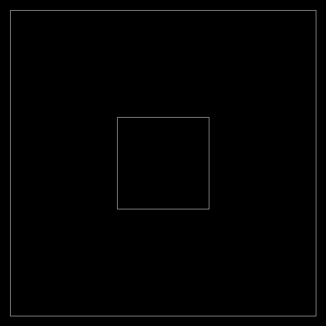
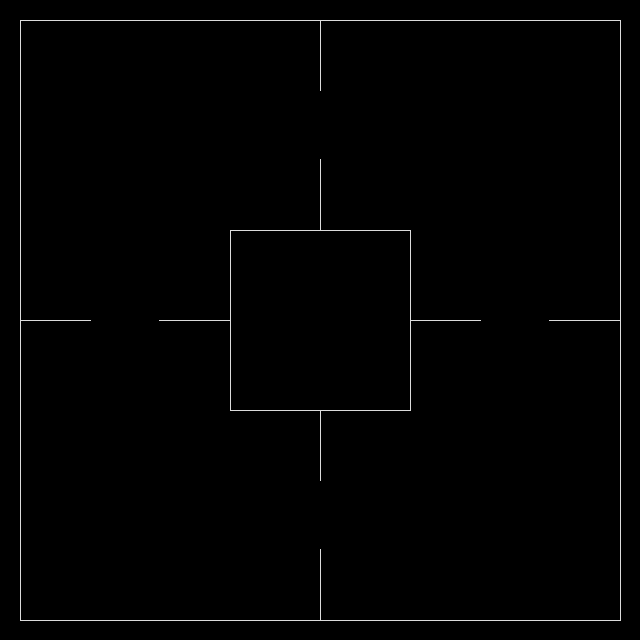
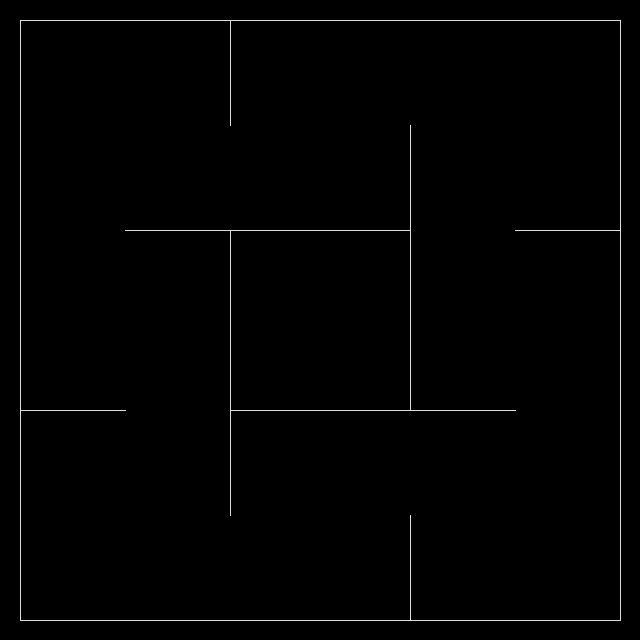
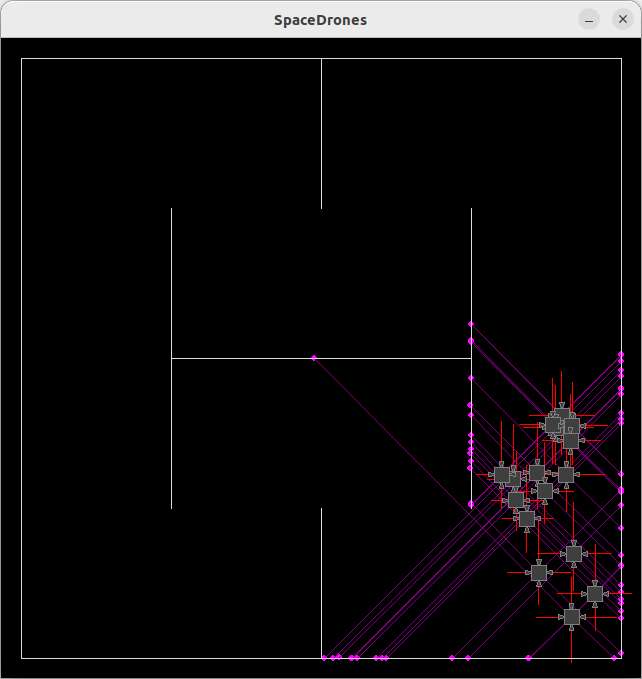
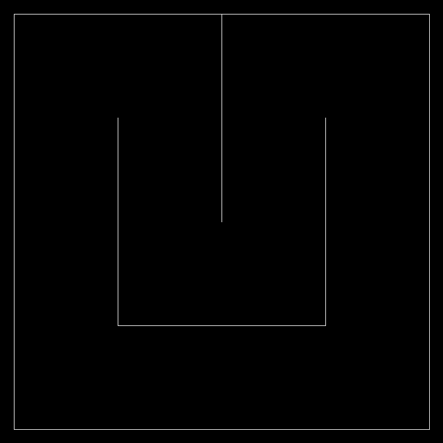

# SpaceDrones 🚀

*SpaceDrones* provides a simple learning environment for genetic optimization with many possible extensions.

The drones' behavior is controlled by the reward function. With the default settings, the drones' goal is to navigate through an environment, covering as much distance as possible in a certain period of time while avoiding collisions with obstacles.

Under the hood, *SpaceDrones* uses *PyBox2D* for the rigid physics simulation and *Pygame* for visualization. The visualization can be turned on and off by clicking on the *Pygame* window or by pressing the space bar. Turning off visualization greatly accelerates the optimization process.

    

 The example above shows non-interacting drones of one generation during the genetic optimization process. The purple lines are determined by ray casting. They can be used to calculate distances to obstacles. The red lines show the force with which the rocket engines are run.

# Method

*SpaceDrones* uses *PyBox2D* to create a physical environment the drones can interact with. Drones use raycasting to gather distance information about obstacles in their surroundings. This information is fed into the drone's neural network to predict the next set of actions. These actions are passed on to the engines, which then command the power at which they should run.

The drones' fitness depends on the defined reward function. The neural network weights of the fittest drone are mutated and passed on to the next generation of drones.

The implementation allows for deactivating drones of the current generation when they collide with other objects.

The drone's brain is modeled by a multilayer perceptron neural network. Neural networks are implemented in NumPy and PyTorch. For small networks, the network implemented in NumPy is considerably faster due to lower overhead.

## Learning

The reward function controls the learning behavior of the drone. As a default, the fitness score depends on how much distance has been covered by the drone and how close it flies to obstacles. The reward function can be modified as desired.

*SpaceDrones* lets you modify many hyperparameters that affect how fast and what the drones learn. Most of the hyperparameters can be found in the *config.yml* file.

## Maps

*SpaceDrones* has different maps that vary in difficulty. Depending on the map, the drones learn different flight behaviors. Maps can be easily added or modified.

|||||
|:--:|:--:|:--:|:--:|
||||
||||

# References

- [PyBox2D](https://github.com/pybox2d/pybox2d) on GitHub.
- [backends](https://github.com/pybox2d/pybox2d/tree/master/library/Box2D/examples/backends) for PyBox2D.
- PyBox2D [tutorial](https://github.com/pybox2d/cython-box2d/blob/master/docs/source/getting_started.md).
- PyBox2D C++ [documentation](https://box2d.org/documentation/).

# TODO:

- Add drone's position to input data.
- Allow interaction between drones
- Allow thrust to have two components

# License

MIT
