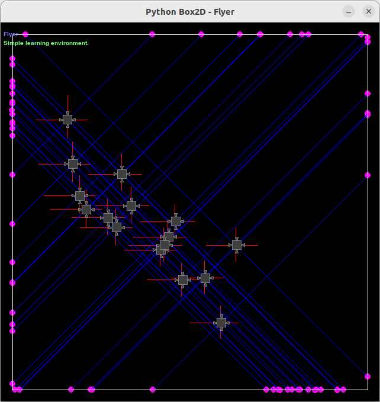

# Drones

*Drones* provides a simple learning environment for genetic optimization with many possible extensions. The drones' goal is to cover as much distance as possible in a certain period of time. *Drones* comes with different worlds that vary in difficulty.

# Method

The environment consists of a square box with rigid walls, containing one or more Flyers. Each Flyer consists of a square body with four boosters attached to each side. Additionally, each Flyer is equipped with a distance meter that looks in four directions.

# Experiments

...

# Results

...

# TODO:

- Refactor rendering
    - Dont flip Y
- Refactor network
- Profile code
- Save best networks
- Allow thrust to have two components
- Use horizontal and vertial rays.
- Accumulate velocity instead of distance?
- Take contact to walls into account when computing score

# License

MIT
