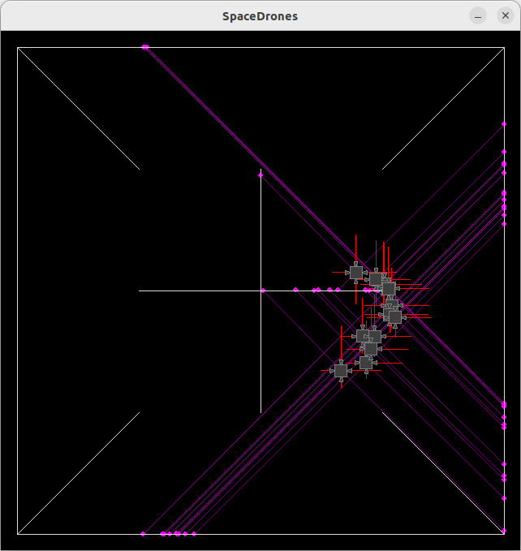

# SpaceDrones 🚀

*SpaceDrones* provides a simple learning environment for genetic optimization with many possible extensions. The drones' goal is to navigate through the environment, covering as much distance as possible in a certain period of time. *SpaceDrones* comes with different worlds that vary in difficulty.

|||
|:--:|:--:|
|||
|||

*SpaceDrones* uses *PyBox2D* for the rigid physics simulation and *Pygame* for visualization. The visualization can be turned off to greatly accelerate the optimization process.

# Method

*SpaceDrones* uses *PyBox2D* to create a physical environemnt the drones can interact with. Drones use ray casting to gather information about obstacles in their environment. This information is fed into a neural network to predict the next set of actions. These actions are passed on to the engines and command the power at which they should run.

The drones' fitness is determined by the distance covered during one generation. The neural network weights of the fittest drone are mutated and passed on to the next generation of drones.

# References

- [PyBox2D](https://github.com/pybox2d/pybox2d) on GitHub.
- [backends](https://github.com/pybox2d/pybox2d/tree/master/library/Box2D/examples/backends) for PyBox2D.
- PyBox2D [tutorial](https://github.com/pybox2d/cython-box2d/blob/master/docs/source/getting_started.md).
- PyBox2D C++ [documentation](https://box2d.org/documentation/).

# TODO:

- Allow to deactivate drone if it hits wall.
- Allow interaction between drones.
- Add drone's position to input data.
- Use data of last $N$ time steps as new input.
- Allow thrust to have two components.

# License

MIT
