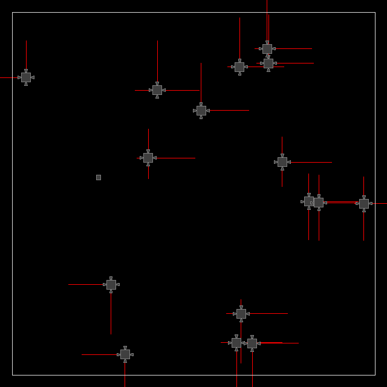
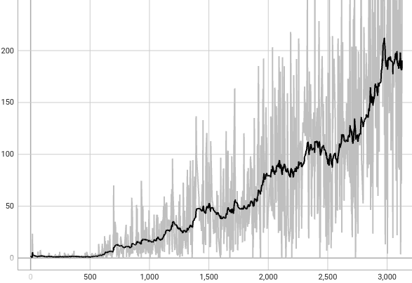

# SpaceDrones 🚀

*SpaceDrones* provides a simple learning environment for evolution-based optimization with many possible extensions.

Under the hood, *SpaceDrones* uses *PyBox2D* for the rigid physics simulation and *Pygame* for rendering and visualization. 

The drones' behavior is controlled by a reward function. The example below shows non-interacting drones trying to follow a target. The red lines show the force with which the rocket engines are run.

<p align="center">
    
</p>

The following graph shows the average reward over a period of about 3000 generations.

<p align="center">
    
</p>

## Installation

To run *SpaceDrones*, install the latest master directly from GitHub. For a basic install, run:

```bash
git clone https://github.com/kaifishr/SpaceDrones
cd SpaceDrones
pip install -r requirements.txt
```

Then start the optimization by running:

```bash
python train.py
```

Evaluate the progress by running:

```bash
python eval.py
```

Visualization can be turned on and off by clicking on the *Pygame* window or by pressing <kbd>Space</kbd>. Turning off visualization greatly accelerates the optimization process. Ray casting can also be turned off by pressing <kbd>r</kbd>.

## Method

*SpaceDrones* uses *PyBox2D* to create a physical environment the drones can interact with. Drones use raycasting to gather distance information about obstacles in their surroundings. This information is fed into the drone's neural network to predict the next set of actions. These actions are passed on to the engines, which then command the power at which they should run.

The drones' fitness depends on the defined reward function. The neural network weights of the fittest drone are mutated and passed on to the next generation of drones.

The implementation allows for deactivating drones of the current generation when they collide with other objects.

The drone's brain is modeled by a multilayer perceptron neural network implemented in NumPy.

## Learning

The reward function controls the learning behavior of the drone. As a default, the fitness score depends on how much distance has been covered by the drone and how close it flies to obstacles. The reward function can be modified as desired.

*SpaceDrones* lets you modify many hyperparameters that affect how fast and what the drones learn. Most of the hyperparameters can be found in the *config.yml* file.

## Maps

*SpaceDrones* has different maps that vary in difficulty. Depending on the map, the drones learn different flight behaviors. Maps can be easily added or modified.

||||
|:--:|:--:|:--:|
||||
||||

## References

- [PyBox2D](https://github.com/pybox2d/pybox2d) on GitHub.
- [backends](https://github.com/pybox2d/pybox2d/tree/master/library/Box2D/examples/backends) for PyBox2D.
- PyBox2D [tutorial](https://github.com/pybox2d/cython-box2d/blob/master/docs/source/getting_started.md).
- PyBox2D C++ [documentation](https://box2d.org/documentation/).

## Citation

If you find this project useful, please use BibTeX to cite it as:

```bibtex
@article{fischer2022spacedrones,
  title   = "SpaceDrones",
  author  = "Fischer, Kai",
  journal = "GitHub repository",
  year    = "2022",
  month   = "July",
  url     = "https://github.com/kaifishr/SpaceDrones"
}
```

## License

MIT
